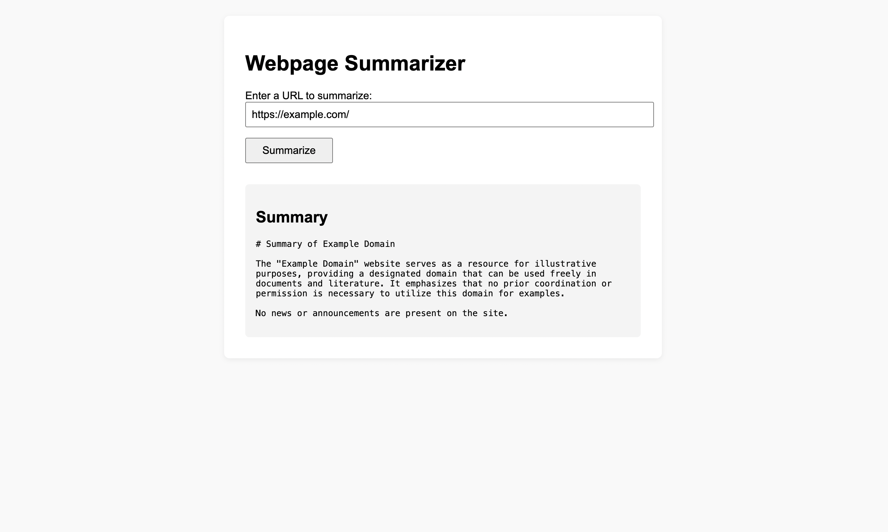

# Webpage Summarizer

A production-ready Python tool for scraping websites and generating AI-powered summaries using OpenAI's GPT models. Features both command-line interface and a web UI for easy interaction.

## Features

- 🌐 **Web Scraping**: Robust scraping with retry logic and error handling
- 🤖 **AI Summarization**: Powered by OpenAI's GPT models (GPT-4o-mini by default)
- 🎯 **Content Cleaning**: Automatically removes navigation, scripts, and other non-content elements
- 🔄 **Retry Logic**: Built-in retry mechanism with exponential backoff
- 🌍 **Web UI**: Simple Flask-based web interface for easy usage
- 🧪 **Comprehensive Testing**: Full test suite with mocked dependencies
- ⚙️ **Configurable**: Customizable scraping and AI parameters

## Installation

2. **Install dependencies:**
   ```bash
   pip install -r requirements.txt
   ```

3. **Set up your OpenAI API key:**
   ```bash
   # Create a .env file
   echo "OPENAI_API_KEY=your-api-key-here" > .env
   ```

## Usage

### Command Line Interface

The main script provides a command-line interface for scraping and summarizing websites:

```bash
# Basic usage
python summarizer.py -u "https://example.com"

# With custom AI parameters
python summarizer.py --url "https://news.ycombinator.com" --model "gpt-4o-mini" --max-tokens 1500

# With custom scraping parameters
python summarizer.py -u "https://blog.example.com" --timeout 60 --retries 5

# Save output to file
python summarizer.py -u "https://www.iana.org/help/example-domains" --output summary.md
```

#### Command Line Options

| Option | Description | Default |
|--------|-------------|---------|
| `-u, --url` | URL to scrape and summarize | Required |
| `--model` | OpenAI model to use | gpt-4o-mini |
| `--max-tokens` | Maximum tokens for summary | 1000 |
| `--temperature` | AI response temperature (0.0-1.0) | 0.7 |
| `--timeout` | Request timeout in seconds | 30 |
| `--retries` | Maximum retry attempts | 3 |
| `--retry-delay` | Base delay between retries | 1.0 |
| `-o, --output` | Output file for summary | Console |
| `-q, --quiet` | Suppress logging output | False |
| `-v, --verbose` | Enable verbose logging | False |

### Web Interface

For a more user-friendly experience, use the web UI:



1. **Start the web server:**
   ```bash
   python webapp.py
   ```

2. **Open your browser:**
   Navigate to [http://127.0.0.1:5000/](http://127.0.0.1:5000/)

3. **Enter a URL and click "Summarize"**

The web interface provides:
- Simple form-based input
- Real-time processing feedback
- Clean, responsive design
- Error handling and display

## Testing

Run the comprehensive test suite:

```bash
python test_scraper.py
```

The test suite includes:
- Unit tests for all classes
- Integration tests with mocked dependencies
- Error handling tests
- Configuration tests

## Project Structure

```
webpage-summarizer/
├── summarizer.py      # Main summarizer logic
├── webapp.py          # Flask web interface
├── test_scraper.py    # Test suite
├── requirements.txt   # Python dependencies
├── README.md         # This file
└── LICENSE           # License information
```

## Core Classes

### `WebSummarizer`
Main orchestrator class that combines scraping and summarization.

### `WebsiteScraper`
Handles web scraping with retry logic and error handling.

### `OpenAISummarizer`
Manages AI-powered summarization using OpenAI's API.

### `Website`
Represents a scraped website with cleaned content.

### `ScrapingConfig`
Configuration for web scraping parameters.

### `OpenAIConfig`
Configuration for OpenAI API parameters.

## Configuration

### Scraping Configuration

```python
from summarizer import ScrapingConfig

config = ScrapingConfig(
    user_agent="Custom User Agent",
    timeout=60,
    max_retries=5,
    retry_delay=2.0,
    remove_elements=["script", "style", "nav", "footer"]
)
```

### OpenAI Configuration

```python
from summarizer import OpenAIConfig

config = OpenAIConfig(
    api_key="your-api-key",
    model="gpt-4o-mini",
    max_tokens=1500,
    temperature=0.5
)
```

## Error Handling

The tool includes comprehensive error handling for:
- Invalid URLs
- Network timeouts
- API errors
- Scraping failures
- Content parsing issues

## Examples

### Summarize a News Article
```bash
python summarizer.py -u "https://news.ycombinator.com/item?id=123456" --max-tokens 800
```

### Summarize a Blog Post
```bash
python summarizer.py -u "https://blog.example.com/post" --model "gpt-4o-mini" --temperature 0.3
```

### Batch Processing (using web UI)
1. Start the web server
2. Process multiple URLs through the interface
3. Copy summaries as needed

## Requirements

- Python 3.7+
- OpenAI API key
- Internet connection for web scraping and API calls

## Dependencies

- `requests`: HTTP requests for web scraping
- `beautifulsoup4`: HTML parsing and content extraction
- `openai`: OpenAI API client
- `python-dotenv`: Environment variable management
- `flask`: Web interface (for webapp.py)

## Contributing

1. Fork the repository
2. Create a feature branch
3. Make your changes
4. Add tests for new functionality
5. Run the test suite
6. Submit a pull request

## License

This project is licensed under the MIT License - see the [LICENSE](./LICENSE) file for details.

## Troubleshooting

### Common Issues

1. **"OpenAI API key not found"**
   - Ensure your API key is set in environment variables or .env file
   - Verify the key is valid and has sufficient credits

2. **"Could not generate summary"**
   - Check if the URL is accessible
   - Verify the website allows scraping
   - Check your internet connection

3. **"Invalid URL"**
   - Ensure the URL includes the protocol (http:// or https://)
   - Verify the URL format is correct

4. **Web UI not loading**
   - Ensure Flask is installed: `pip install flask`
   - Check if port 5000 is available
   - Verify the webapp.py file is in the correct directory

### Performance Tips

- Use `gpt-4o-mini` for faster, more cost-effective summaries
- Adjust `max_tokens` based on your needs
- Use appropriate timeouts for different types of websites
- Consider caching results for frequently accessed URLs

## Support

For issues, questions, or contributions, please open an issue on the project repository. 